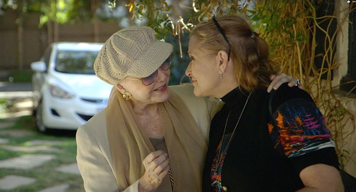

# Exercise 2

Learn the basics of git workflow, including adding new files.

1. **Fork** the repo onto your own github account  
(maybe you already did it).

2. clone it to your laptop  
`git clone ...`

3. Download an image from the web and place it into the repo folder
   into _exercise-2_ subfolder.
   
4. Add this file to _git_.  See [Adding
   Files](file:///home/otoomet/tyyq/teaching/info201/book/localbook/build/git-basics.html#adding-files). 

5. Add the image to this file using markdown syntax.
   
5. Write a paragraph of text where you explaine what the picture is
   about.  Feel free to add more.

4. commit your changes:  
`git commit -am "<explain what did you do>"`

5. send your edits back to GitHub
`git push`

6. check the repo on your github account.  Did it work?

This is a photo of Carrie Fisher and her mother, Debbie Reynolds, from the HBO documentary *Bright Lights*.
Here they are getting ready to go out for the day, something that was easy for the two as their houses were
in joined compound (Carrie often used the path down the hill to visit/check up on her mother next door).
As a small aside, they were signing here. They often liked to sing together, and Debbie especially enjoyed
hearing her daughter's voice.